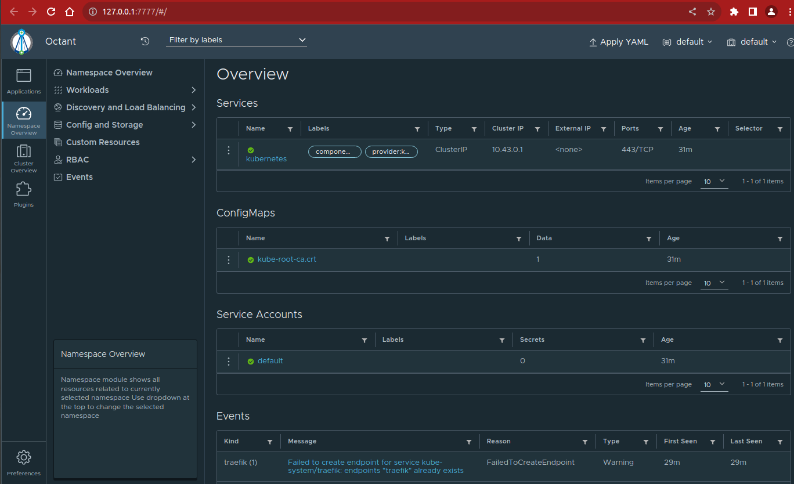

# K3s Installation on Vagrant

You need install some tools first and please refer to their official websites to setup into your PC or computer since it will have different steps if have different operating system.

#### Prerequisite
- VirtualBox
- Vagrant

If you want install VirtualBox please visit here: https://www.virtualbox.org/wiki/Downloads and select with the correct package that same with your operating system.

For Vagrant, you can check in here: https://www.vagrantup.com/downloads

#### Prepare the Vagrantfile
You can choose to use directly the Vagrantfile that I’ve created or create it from scratch, since I will provide you to create it.

- Please make sure where you want to store the Vagrantfile  
- Open terminal/powershell/cmd and make sure the current directory is correct.  
- Run `vagrant init`


- Open the Vagrantfile
- Update the section of config.vm.box from base to generic/alpine312 , I decide to use alpine as my base box, you can choose another box that you are more familiar with.


- Since I will try to connect into the development environment from host, I open an address so I can access my development environment.

**k3s.vm.network "private_network", ip: "192.168.56.10"**  

I have update the Vagrantfile as below :

Here is the final *Vagrantfile*

```
IMAGE_NAME = "bento/ubuntu-18.04"

Vagrant.configure("2") do |config|
    config.ssh.username = "vagrant"
    config.ssh.password = "vagrant"
    config.ssh.insert_key = true

    config.vm.provider "virtualbox" do |v|
        v.memory = 4096
        v.cpus = 2
        v.name = "K3S"
    end
      
    config.vm.define "K3S" do |k3s|
        k3s.vm.box = IMAGE_NAME
        k3s.vm.network "private_network", ip: "192.168.56.10"
        k3s.vm.hostname = "k3s-server"
    end
  
end
```

 Use `vagrant up` command to bring up vagrant and wait until finished

 

- Connect to the environment use vagrant ssh


- Install K3s (please refer into the official website: https://k3s.io/ if it’s different step with the step in here) — it will take a while

```
curl -sfL https://get.k3s.io | sh -s - --write-kubeconfig-mode=644
```


- Check the nodes and pods (By default you need to go root for checking)

```
kubectl get nodes
```  

```
kubectl get po -A
```  


### Connecting from host machine

Make sure that the k3s config file is avalible in the */etc/rancher/k3s/k3s.yaml* location on the vagrant


Copy file to Vagrant's folder on the host machine  
```
sudo cp /etc/rancher/k3s/k3s.yaml /vagrant/config
```


Exit from the vagrant machine 
```
exit
```  


On the Host machine, copy config file from the vagrant folder to .kube folder

```
cp config ~/.kube/
```
  
Open *~/.kube/config* file in your favorate editor 


Change the IP Address from localhost to Vagrant's IP Address


Now you will be able to access k3s from the host machine


### Installing Kubernetes Web UI

Instead of installing kubernetes-dashboard I would like to install Octant

Go to https://octant.dev/ and download from the Github link


Depending on the host machine download the binaries, in my case I have downloaded octant_0.25.1_Linux-64bit.deb

```
wget https://github.com/vmware-archive/octant/releases/download/v0.25.1/octant_0.25.1_Linux-64bit.deb
```  

Install package

```
sudo dpkg -i octant_0.25.1_Linux-64bit.deb
```  

execute command to open Kubernetes Web UI

```
octant
```  

It will open in the default browser automatically http://127.0.0.1:7777/#/



### Install ArgoCD on K3s  

```
kubectl create namespace argocd
```  

```
kubectl apply -n argocd -f https://raw.githubusercontent.com/argoproj/argo-cd/stable/manifests/install.yaml
```  

After installation complete execute below command to verify installation successful.

```
kubectl get po -A -w
```


Open Octant browser 
- Change the namespace from the dropdown
- Go to Services section
- Click on the argocd-server 


Edit the service YAML file in order to access ArgoCD UI from the host machine update as shown in the screenshot 

<pre>
spec:
  allocateLoadBalancerNodePorts: true
  clusterIP: 10.43.11.47
  clusterIPs:
  - 10.43.11.47

  <span style="color:blue">
  externalIPs:
  - 192.168.56.40
  externalTrafficPolicy: Cluster
  </span>
  .
  .
  .
  <span style="color:blue">
  type: LoadBalancer
  </span>
</pre>


Once updated you will be able to see the LoadBalancer in the services


Access the ArgoCD UI from the host machine

https://192.168.56.40:30554/ and 

- click on the **Advanced** button

- click on **Proceed to 192.168.56.40 (unsafe)**


- Enter the user id and password

- Default user is `admin` and password need to get from the argocd secret

execute the below command to get password  

```
kubectl -n argocd get secret argocd-initial-admin-secret -o jsonpath="{.data.password}" | base64 -d
```  


To stop K3s

```
/usr/local/bin/k3s-killall.sh
```
